# 🔨 AuctionHub - Premium Digital Marketplace

[](https://dotnet.microsoft.com/)
[](https://docs.microsoft.com/en-us/ef/core/)
[](https://getbootstrap.com/)
[](LICENSE)
[](https://auction.kadiryazadzhi.tech/)

**AuctionHub** is a high-performance, enterprise-grade digital marketplace built with **ASP.NET Core 8.0**. It features a multi-layered architecture, real-time bidding via SignalR, AI-powered image moderation, and a robust financial ledger system. Designed for scalability, it is currently deployed on a private **K3s Kubernetes cluster**.

<br />
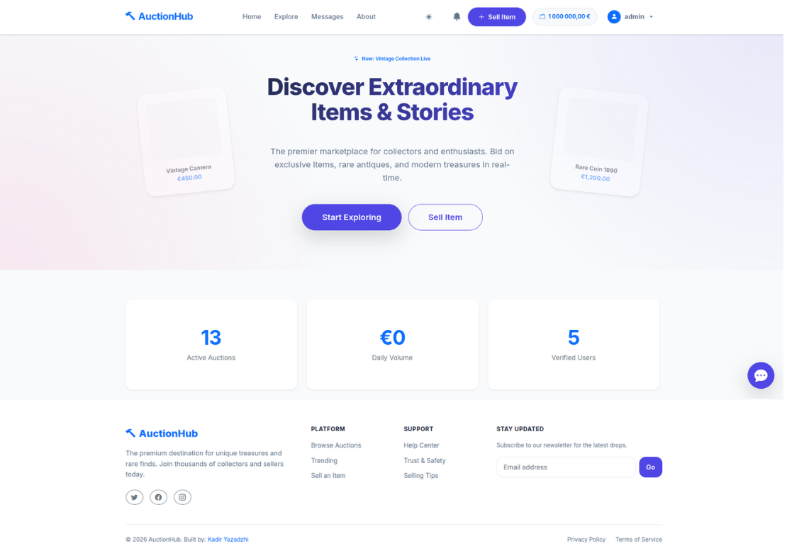
<br />

---

## 📑 Table of Contents
1. [🌟 Key Features](#-key-features)
2. [📸 Gallery & UI](#-gallery--ui)
3. [⚙️ How It Works](#-how-it-works)
4. [🏗️ Technical Architecture](#-technical-architecture)
5. [💾 Database Schema](#-database-schema)
6. [📂 Project Structure](#-project-structure)
7. [🚀 Installation & Environment](#-installation--setup)
8. [🧪 Testing](#-testing)
9. [☁️ Deployment (K3s)](#-deployment-k3s)

---

## 🌟 Key Features

### 🛒 Advanced Auction Mechanics
* **Dynamic Listings:** Standard auctions with customizable start/end times and increments.
* **Dutch Auction Mechanic:** Reverse auction support where the price drops over time until someone buys.
* **Private Negotiation:** "Private Offers" system allowing direct price negotiation between buyers and sellers.
* **Smart Bidding (SignalR):** 
    * **Live Updates:** Bids reflect instantly across all connected clients without page refresh.
    * **Auto-Bidder:** Users can set a maximum price, and the system outbids competitors automatically.
    * **Anti-Snipe Protection:** Auctions are automatically extended if a bid is placed in the final minutes.
* **Participation Fee (Tickets):** Premium auctions can require a "Bidding Ticket" purchase before entry.

### 💰 Financial Ecosystem (Wallet & Escrow)
* **Internal Banking:** Comprehensive digital wallet for every user with full transaction history.
* **Escrow Service:** Automated fund locking (Hold) during active bids to guarantee payment.
* **Instant Refunds:** Real-time fund release back to users when they are outbid.
* **Secure Settlements:** Funds are only released to the seller upon delivery confirmation or admin resolution.

### 🛡️ Administration & Moderation
* **Global Dashboard:** Advanced metrics (Platform Volume, User Growth, System Integrity).
* **Audit Logs:** Full traceability of all admin actions (suspensions, setting changes, user management).
* **Dispute Resolution:** Integrated system for admins to mediate and resolve transaction conflicts.
* **System Controls:** Dynamic management of commission rates, promotion fees, and platform-wide settings.

### 🔔 Social & Engagement
* **Community Feed:** Public comments and discussions on every auction listing.
* **Reputation System:** Five-star reviews and feedback allowed only after verified successful trades.
* **Seller Following:** Users can follow favorite sellers to get notified of new listings.
* **Notifications:** Real-time alerts for outbids, wins, and social interactions.
* **AI Image Moderation:** Automated safety check for all uploaded images to prevent inappropriate content.

---

## 📸 Gallery & UI

### 1. User Experience (The Marketplace)

**Explore All Auctions**
*A clean grid view of all available items with real-time status.*
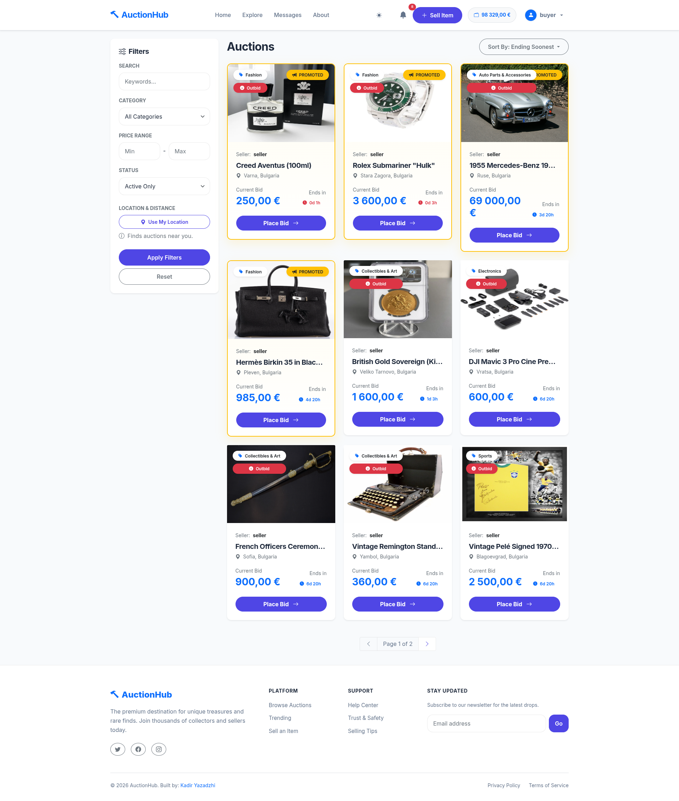

**Advanced Filtering**
*Multi-criteria filtering by Category, Price, Distance (Geolocation), and Status.*
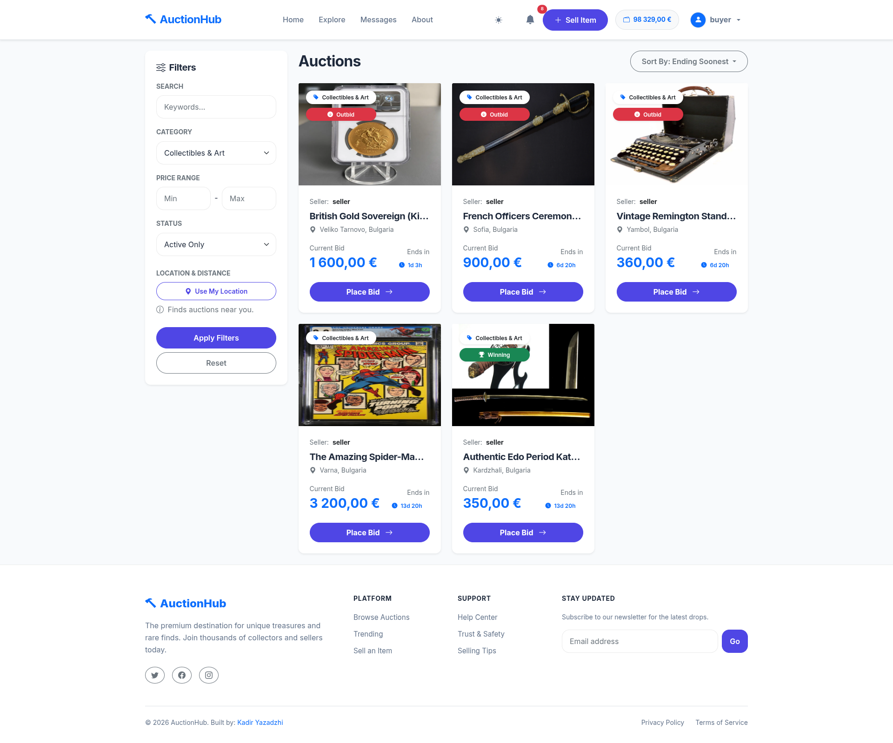

**Auction Details & Bidding**
*Detailed view showing bid history, private offers, and real-time countdown.*
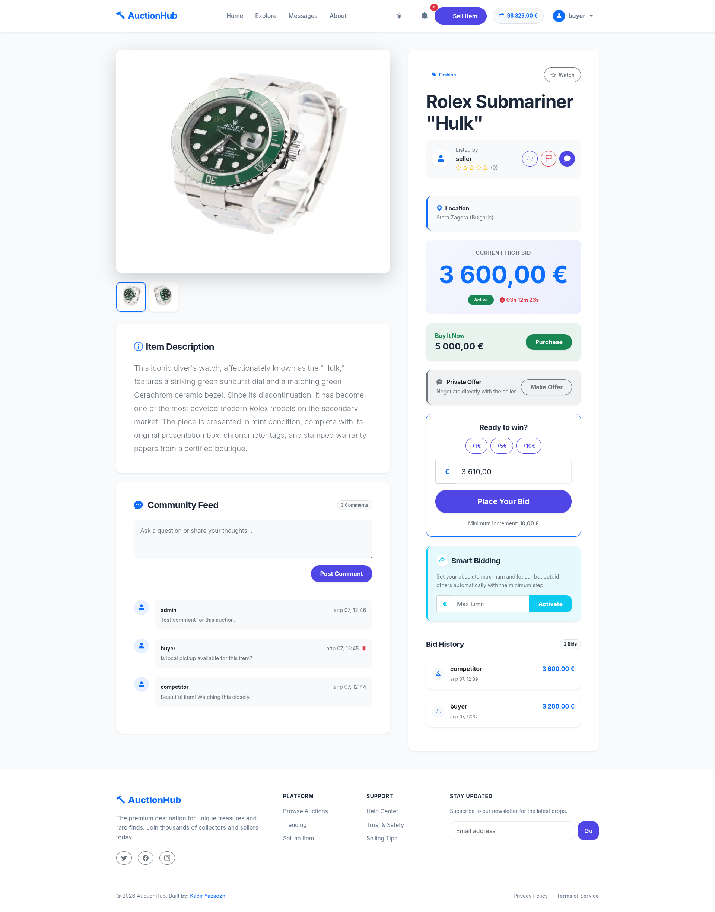

**Seller Analytics**
*Dynamic charts showing views and engagement for listed items.*
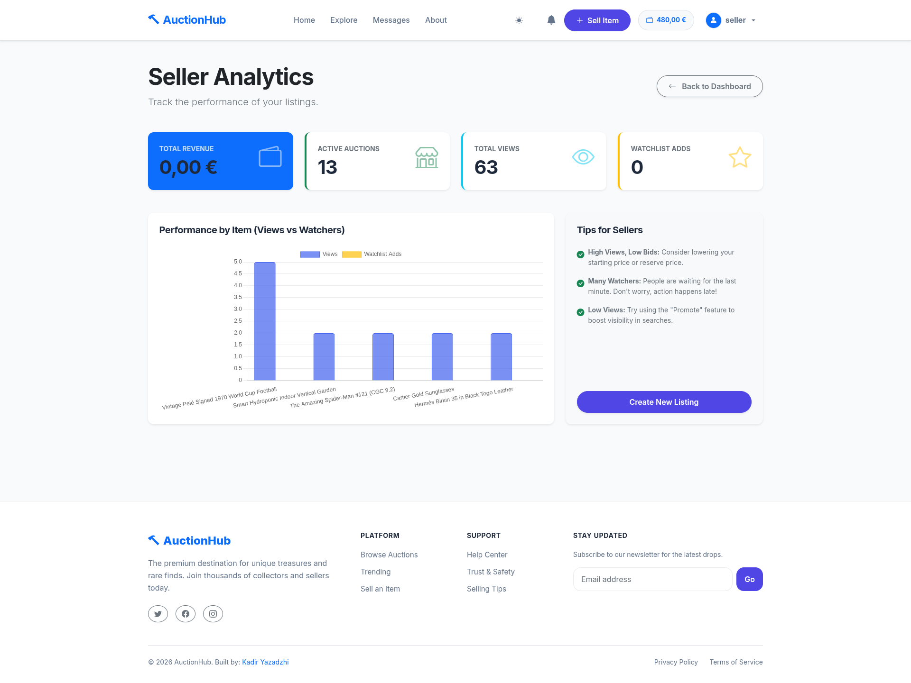

**My Wallet**
*The financial hub showing balance, escrowed funds, and detailed ledger.*
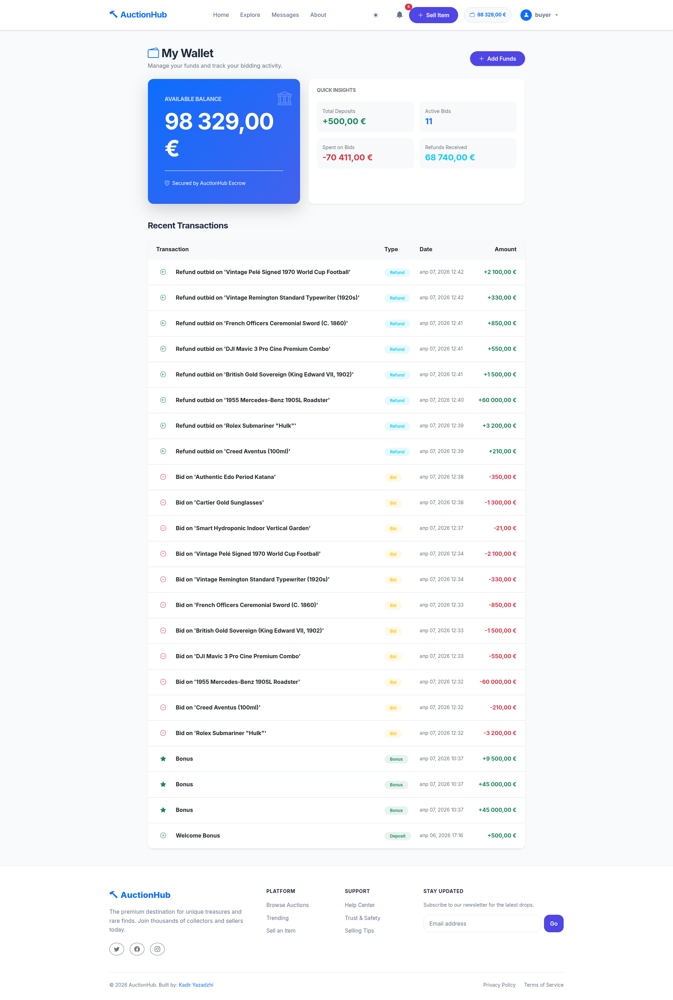

---

### 2. Administration Area

**Admin Dashboard**
*Real-time platform metrics and system integrity checks.*
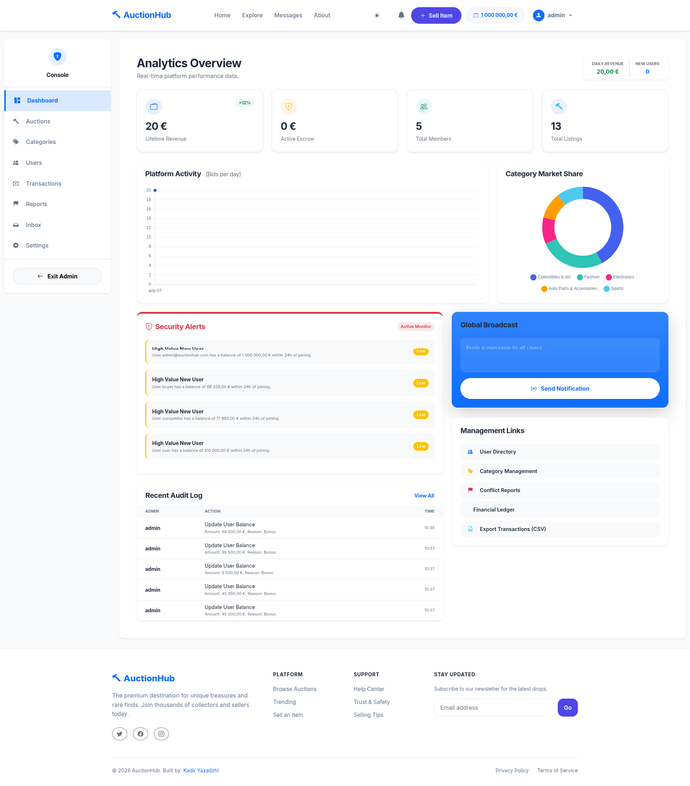

**Admin Inbox**
*Internal communication and support ticket management.*
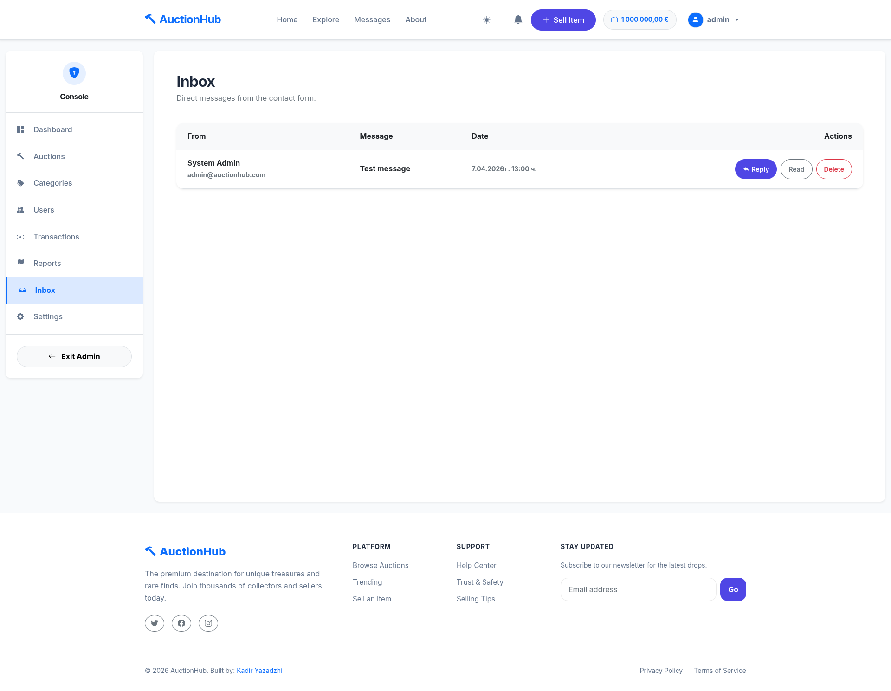

**User & Auction Moderation**
*Tools to manage user roles, suspend listings, and resolve disputes.*
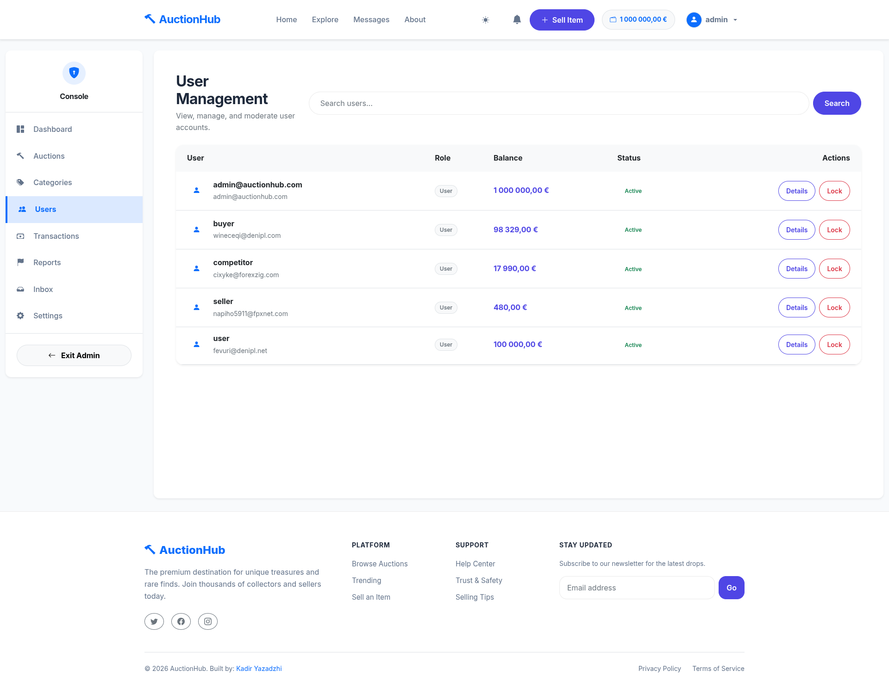
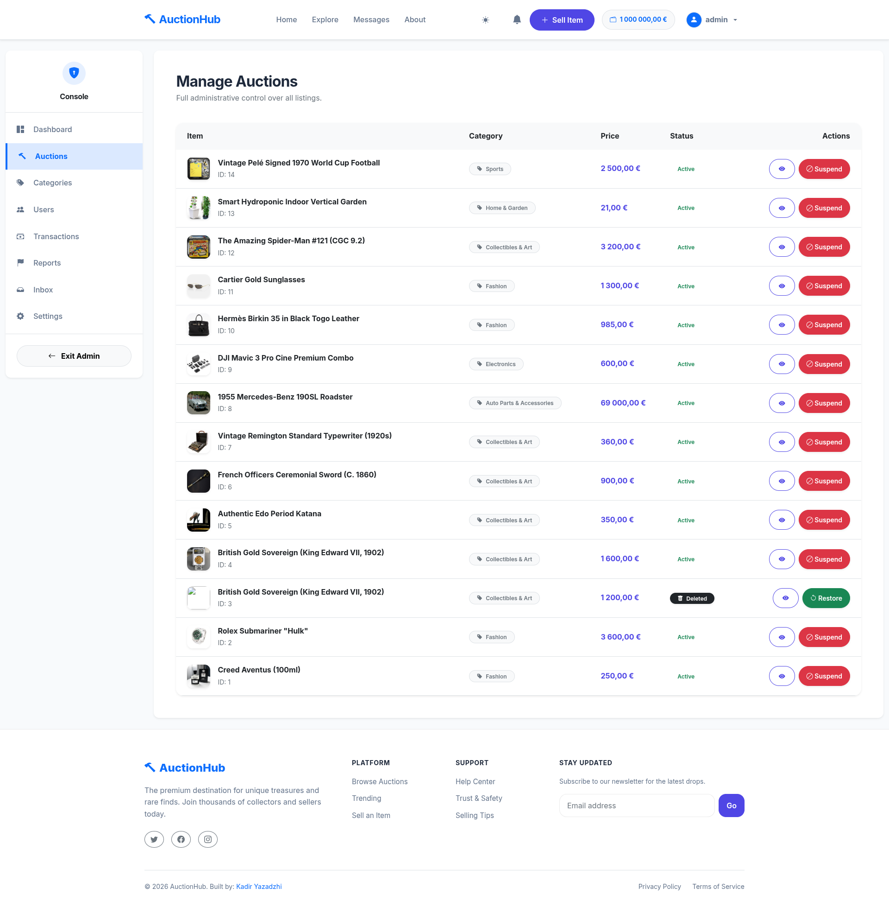

**Category Management**
*Create and edit product categories with specific icons.*
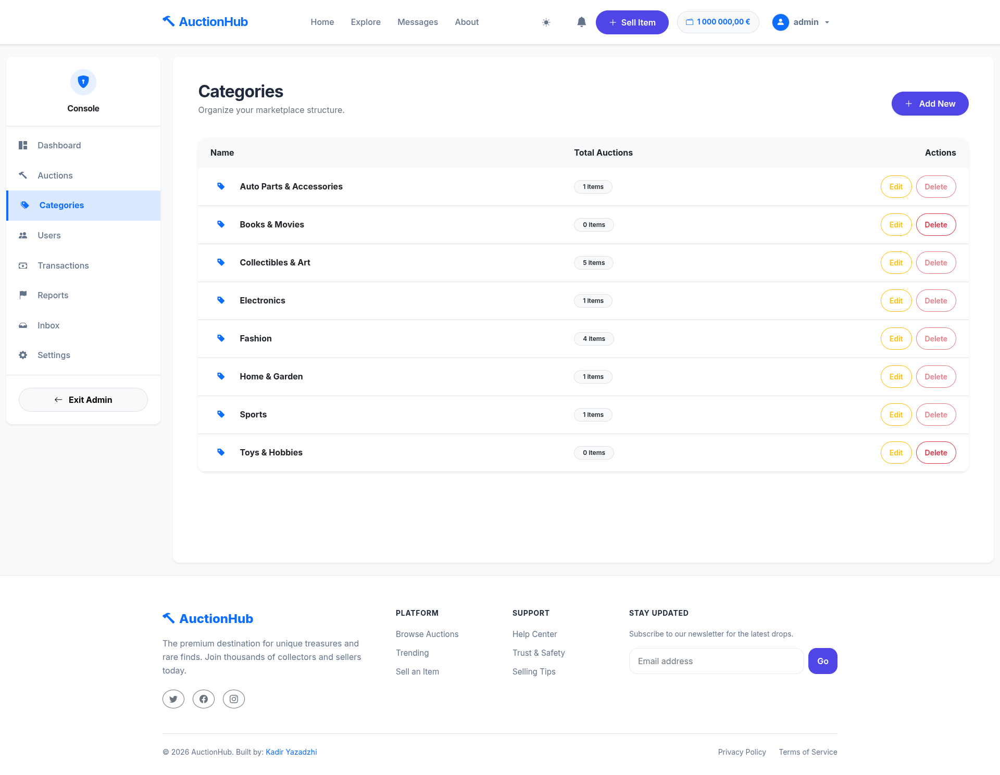

**Transaction Logs**
*Audit trail of all financial movements in the system.*
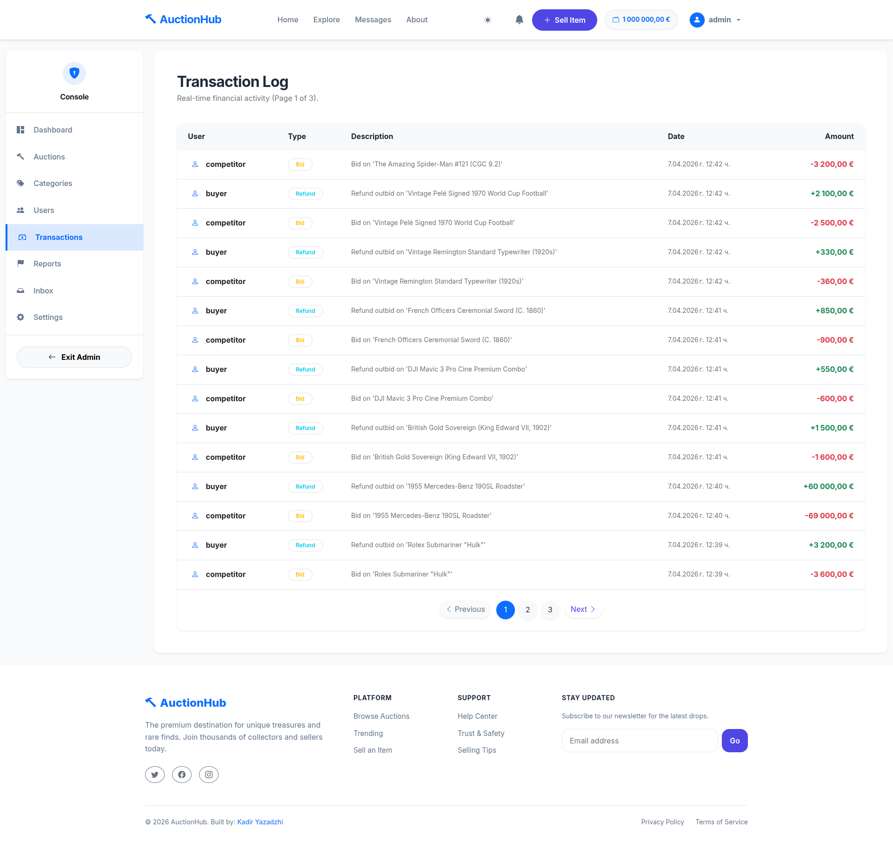

---

## 🏗️ Technical Architecture

The project follows **Clean Architecture** principles, ensuring a strict separation of concerns.

* **Presentation Layer:** ASP.NET Core MVC with SignalR (Real-time) and Razor Pages.
* **Application Layer:** Business logic, Service interfaces, and DTOs. High testability via DI.
* **Domain Layer:** Core entities, business rules, and shared abstractions.
* **Infrastructure Layer:** EF Core (SQL Server), Redis (Caching & SignalR Backplane), Cloudinary (Image storage), and Hangfire (Scheduled Jobs).

### Tech Stack
| Component | Technology |
|-----------|------------|
| **Framework** | .NET 8.0 (C# 12) |
| **Real-time** | SignalR (with Redis Backplane) |
| **Background Jobs**| Hangfire (SQL Server Storage) |
| **Database** | MS SQL Server |
| **Caching** | Redis (Distributed Cache) |
| **Storage** | Cloudinary (Cloud Image API) |
| **AI Moderation** | Hugging Face (NSFW Image Detection) |
| **Testing** | xUnit, Moq, FluentAssertions |

---

## 🚀 Installation & Setup

### 1. Environment Configuration (.env)
The application requires several external services. Create a `.env` file in the root directory with the following keys:

```env
# --- Database ---
ConnectionStrings__DefaultConnection="Server=YOUR_SERVER;Database=AuctionHubDb;User Id=YOUR_USER;Password=YOUR_PASSWORD;TrustServerCertificate=True;"

# --- Identity & OAuth ---
# Required for social login functionality
Authentication__Google__ClientId="your_google_id"
Authentication__Google__ClientSecret="your_google_secret"
Authentication__GitHub__ClientId="your_github_id"
Authentication__GitHub__ClientSecret="your_github_secret"

# --- Cloudinary (Image Storage) ---
# Required for uploading auction images
Cloudinary__CloudName="your_cloud_name"
Cloudinary__ApiKey="your_api_key"
Cloudinary__ApiSecret="your_api_secret"

# --- Redis (Caching & SignalR) ---
# Required for distributed scaling and real-time performance
Redis__Configuration="localhost:6379,password=your_redis_password"

# --- AI Image Analysis (Hugging Face) ---
# Get your free token at: https://huggingface.co/settings/tokens
AI__HuggingFaceToken="your_hugging_face_token_here"
```

### 2. Standard Local Setup
1. **Clone the Repo:**
   ```bash
   git clone https://github.com/KadirYazadzhi/AuctionHub
   cd AuctionHub
   ```
2. **Apply Database Migrations:**
   ```bash
   dotnet ef database update --project AuctionHub.Infrastructure --startup-project AuctionHub
   ```
3. **Run the Application:**
   ```bash
   dotnet run --project AuctionHub
   ```

---

## 🧪 Testing

The project implements a rigorous testing strategy covering over **65% of business logic**.

* **Unit Tests:** Business rules, wallet calculations, and bid validations.
* **Integration Tests:** Database transactions and SignalR connectivity.

Run all tests:
```bash
dotnet test
```

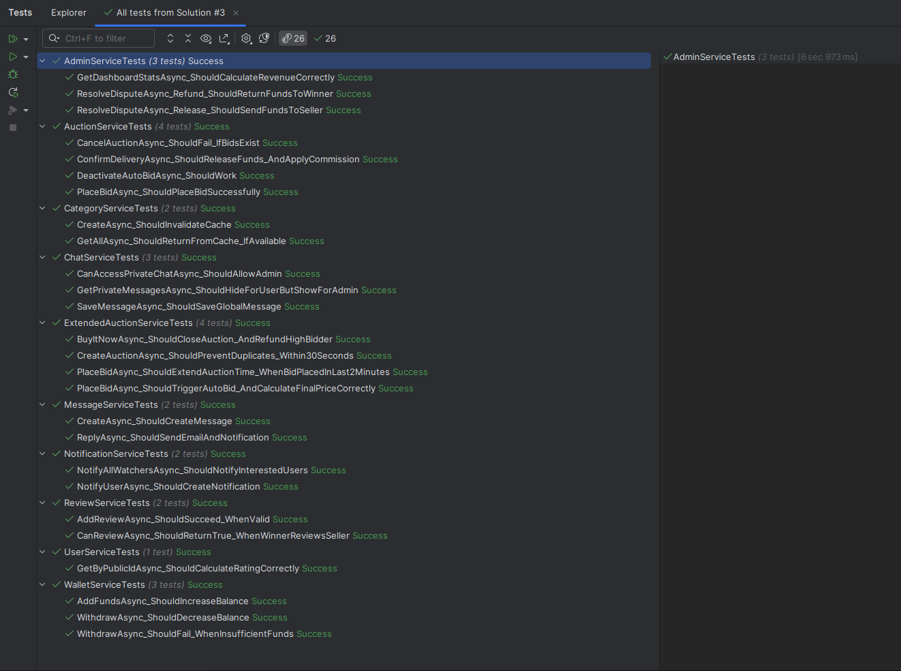

---

## ☁️ Deployment (K3s)

This application is fully production-ready and hosted on a **self-managed K3s (Lightweight Kubernetes) клъстер**.

* **Cluster Architecture:** Multi-node setup with automated SSL handling via **Cert-Manager** and **Let's Encrypt**.
* **Ingress:** **Traefik Ingress Controller** routing traffic to `auction.kadiryazadzhi.tech`.
* **Resilience:** Redis-backed SignalR allows the application to scale across multiple pods without losing real-time state.
* **Monitoring:** Integrated health checks and automated background job monitoring via Hangfire.

> 📂 **Detailed Kubernetes Docs:** A comprehensive guide on how to deploy this entire stack (including SQL and Redis) on K3s, along with the YAML manifests, can be found in the `/deployment` folder (coming soon).

---
*Project created for SoftUni ASP.NET Advanced Course.*
